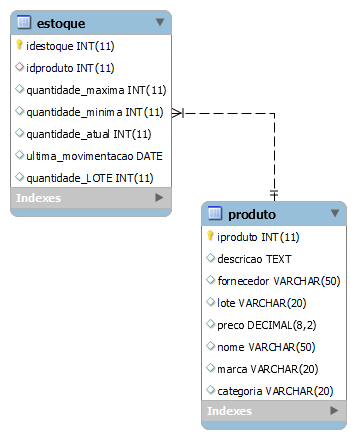

# Estudo de caso
## Casa Oliveira


Roberto é dono de um mercado no bairro de Vargem Grande, na cidade de Tupã. Ele herdou o negócio de seu pai, Gumercindo Oliveira, ela foi aberta em 1978 na garagem da casa da família, era uma pequena quitanda. Com o passar dos anos o negócio cresceu e Gumercindo foi obrigado a ir para outro ponto maior e ali permaneceu até os dias atuais.


Roberto, que agora é o novo dono do mercado continuou o negócio seguindo da mesma forma que o pai. Ele comprava diretamente com os fornecedores grandes volumes de produtos e armazenava em seu estoque. As vezes ele comprava muitos produtos que ainda havia em estoque causando uma sobrecarga de produtos, ele também tinha muitos produtos estragados, tais como: frutas, legumes, iogurtes, leites, frango, etc. Também havia muitos produtos com o prazo de validade vencido.


Os funcionários eram poucos e faziam muitas coisas ao mesmo tempo. O açougueiro também ajudava no estoque, a moça da limpeza ajudava na organização dos produtos das prateleira, além de ajudar na padaria, quanto o caixa estava vazio o operador ajudava a repor os laticínios e a limpar a loja. O repositor também fazia operação no caixa.


Ao realizar a venda o Roberto, que sabia o nome de quase todos os clientes, anotava em um caderno todos os produtos que vendia e que havia em estoque. Ao fim do dia , Roberto pegava o caderno de fazia os cálculos de o quanto havia vendido, somando o faturamento e realizando a atualização do estoque. Isso é feito todos os dias e tomava um tempo considerável para que tudo tenha sido feito.


Roberto fechava a loja as 18h, mas só ia para casa as 22h, após fazer todas as operações necessárias. Mesmo assim o negócio vai bem e Roberto pretende ir para outro ponto e aumentar o volume de negócios e contratar novos funcionários.


Marica, esposa de Roberto, vem conversando com ele há muito tempo para que ele contrate uma empresa para construir um sistema de informática para gerenciar o negócio e reduzir o tempo que ele passa trabalhando e tenha maior organização dos produtos, maior lucratividade e melhorar a gestão.


Com a intenção de aumentar o negócio, Roberto está disposto a informatizar sua empresa. Vamos ajudá-lo. Iremos começar construindo o banco de dados.


### Problemas a se solucionar: 

-Gerenciamento de estoque; 

-Falta de funcionários; 

-Funcionario desempenhando outras funções; 

-Fluxo de caixa (Entrada | saída de valores) 

-Baixa no estoque 

-Gestão do patrimônio: Computadores, Prateleiras, geladeiras, fogão, carrinho, caixas, balcões da padaria e açougue, balanças, etc..  

-Setor de compras  

-Setor de financeiro 


Gestão de Estoque 

-Informação sobre os produtos ( validade, valor, lote, nome, descrição, marca, idproduto, categoria, fornecedor) 

 Volumes de produtos em estoque (quantidade atual, quantidade por lote, ultima movimentação, quantidade máxima, quantidade mínima, id produto) 

Funcionário 

-Informação(Nome, função | cargo, salario matricula, cpf, rg, telefone, email, estado civil, admissao, data_nascimento, endereço, usuário, senha, senha, idfuncionári) 

Fluxo de caixa ( forma pagamento, limite sangria, valor entrada | saida, registre_venda) 

Gestão de Patrimônio 

Informação_Patrimônio(idpatrimonio, codigopatrimonio, descrição, valor, nome, setor pertencente, data de aquisição, setor responsavel, data baixa,   

Gestão de compras (IDcompra, funcionário, valor pag produto, fornecedo, data compra, numero nota fiscal, nome produto, descrição consumivel, quantidade, sertor_destino) 

Setor 

Informação_financeiro(idfinanceiro, despesas, lucro, disponibilidade cofre, valor, tipo valor, descrição, data operação, identificação_responsável) 

## Modelo conceitual


## Modelo Logico 

!["Digrama Modelo Conceitual"][def]

[def]: ./modelologicoesque.png

## Modelo Físico 

```
 /*Para o projeto de bando de dados da casa oliveira, será criado uma estrutura física com os comandos SQL (Structure Query Language). Iremos começar
 com o comando de criação de banco de dados. 
 Este comando pertence a categoria de comandos DFL (Data Definition Language)
 Comando:
 CREATE DATABASE nome_do_banco -> CREATE DATABASE casaoliveira*/

```

```
 CREATE DATABASE casaoliveira;

 /* Após a criação do banco de dados, é necessário seleciona-los. Para isso, iremos usar o comando Use nome_do_banco_dedados */

 USE casaoliveira;

```

```
 /* Criação das entidades em modo físico usando os comandos em SQL. Para ciar uma entidade (Tabela) usaremos o comando 
 CREATE TABLE nome_da_tabela seguido por parenteses e os atributos (campos) da tabela, bem como a sua tipificação, ou seja, devemos
 dizer qual é o tipo de informação que cada campo (atributo) que cada tabela deve receber.
 Ex: o campo idade deve receber valor numerico e será definido como int(inteiro). */
```
 
```

  /* Vamos criar a tabela de produto. Esta tabela possui:  idproduto, descricao, fornecedor, validade, nome, marca, categoria.alter.
  Para cada campo será definido um tipo de dado. Para  id, iremos definir com:alter: 
  Chave primária(Primary Key- PK), é o nosso indexador, por ele será realizado o relacionamento de outras tabelas. 
  Vamos deifinir este campo auto_incremente, o que permite gerar os ids, de forma automática. Esse campo é importante, pois ele elimina
  alguns problemas, tais como: COncorrência, geração incrementada de valores e exclusividade de valores.
  Vamos definir o campo o tipo de dado numerico in (inteiro)
  Par a campo descirção, usaremos o tipo de dado Text. Com este tipo podemos inserir até 64 mil caractere. Como neste campo haverá a possibilida de uma descriçã
  longa do produoto, se faz necesario um tamanho maior.  
 
 ```

 ```
 Para o fornecedor, usaremos o tipo de dado VARchar.Este tipo de dados nos permite inserir textos, mas com limite que pode ser deninido pelo usuario ou podemos 
 utilizar o limite total de 255 caracteres. Para o fornecedor, usaremos 50 caracteres.
 Para o campo validade usaremos o campo do tipo DATE.

 ```
 ```
 
 Para o campo lote, será definido o tipo de campo VarCHar, pos há  a possibilidade de valor conter características alfadecimas. Sendo assim, o VARCHAR é uma ótima opção para aceitar valores diversos. 
```
 O campo preço será definido como DEcimal. Com ese tipo é possível iserir valores númericos com aplicação de casas decimais. Ex. : DECIMAL(10,2) 
 -> COMPRIMENTO DE 10 DIGITOS E DESTES 2 TEMOS DUAS CASAS DECIMAIS.
 VEJA: 11111111,11 -> 11.111.111,11 -> R$35.665.235,23
 ```

 ```
 Para os campos nome, marca e categoria, será definido o tipo de dado VARCHAR, pois deste tipo é capaz de receber caracteres de texto. Precisaremos apenas
 definir o tamanho de cada campo. Nome pode ficar com o tamanho 50, marcar pode ficar com o tamanho 30 e categoria 20.
 */
```


 

  CREATE TABLE produto (
  iproduto int auto_increment primary key,
  descricao text,
  fornecedor varchar (50),
  lote varchar (20),
  preco decimal (8,2),
  nome varchar (50),
  marca varchar (20),
  categoria varchar (20)
  );
 
  CREATE TABLE estoque (
  idestoque int auto_increment primary key,
  idproduto int,
  quantidade_maxima int,
  quantidade_minima int,
  quantidade_atual int,
  ultima_movimentacao date,
  quantidade_LOTE int
  );  

```


### Modelo Físico -MER (Modelo de Entidade Relacional)

